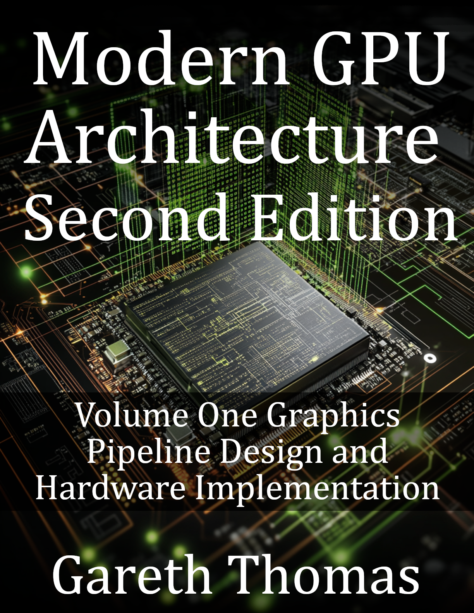

# Modern Gpu Architecture

### Cover

### Repository Structure
- `covers/`: Book cover images
- `blurbs/`: Promotional blurbs
- `infographics/`: Marketing visuals
- `source_code/`: Code samples
- `manuscript/`: Drafts and format.txt for TOC
- `marketing/`: Ads and press releases
- `additional_resources/`: Extras

View the live site at [burstbookspublishing.github.io/modern-gpu-architecture](https://burstbookspublishing.github.io/modern-gpu-architecture/)
---

- Modern GPU Architecture: Graphics to AI Acceleration

---
## Chapter 1. GPU Architecture Principles
### Section 1. GPU vs CPU Philosophy
- Throughput over latency
- Task parallelism vs instruction-level parallelism
- Scalability and energy efficiency
- Suitability for graphics and compute workloads

### Section 2. SIMT Execution Model
- Threads and warps/wavefronts
- SIMD-style execution with per-thread state
- Divergence handling and reconvergence
- Warp scheduling and masking

### Section 3. Modern GPU Overview
- NVIDIA SM, AMD CU, Intel Xe-core comparison
- Streaming multiprocessor internal organization
- Compute and graphics pipeline integration
- Role of schedulers and dispatch units

### Section 4. Memory Hierarchy Snapshot
- Register files and local storage
- Shared/LDS memory
- L1, L2, and VRAM hierarchy
- Latency and bandwidth tradeoffs

---
## Chapter 2. Digital Design for GPUs
### Section 1. Verilog and SystemVerilog Essentials
- Modules, ports, and parameters
- Procedural and continuous assignments
- Always blocks and combinational logic
- Timing control and simulation

### Section 2. Pipeline Design
- Pipeline depth and balancing
- Register placement and retiming
- Valid-ready handshaking
- Control and data path separation

### Section 3. Clock Domain Crossing and Handshaking
- Metastability and synchronization
- FIFO-based CDC mechanisms
- Dual-clock RAM interfaces
- Gray-coded counters

### Section 4. Floating-Point Units
- FP32, FP16, and BF16 support
- Fused multiply-add (FMA) structure
- Normalization and rounding
- Verification and corner-case handling

### Section 5. Verification Basics
- Testbench architecture
- Assertions and functional coverage
- Waveform inspection and debugging
- Regression testing

---
## Chapter 3. 3D Graphics Fundamentals
### Section 1. Geometric Primitives
- Vertices, edges, and triangles
- Indexed and non-indexed primitives
- Vertex attributes and interpolation
- Coordinate spaces and transformations

### Section 2. Transformations
- Model, view, and projection matrices
- Perspective vs orthographic projection
- Homogeneous coordinates
- Matrix composition order

### Section 3. Rasterization
- Edge equations and barycentric coordinates
- Pixel coverage determination
- Sampling and antialiasing
- Tile-based versus immediate rendering

### Section 4. Shading and Lighting
- Gouraud and Phong shading
- Lambertian reflection
- Specular highlights
- BRDF introduction

### Section 5. Texture Mapping
- UV coordinate generation
- Filtering and mipmapping
- Texture addressing modes
- Texture compression formats

---
## Chapter 4. System Architecture
### Section 1. Clocking and Power
- Multi-domain clock networks
- Dynamic frequency scaling
- Clock gating and power gating
- Thermal limits and throttling

### Section 2. Memory Interfaces
- GDDR6 and HBM3 architectures
- Channel width and data rates
- Memory controller scheduling
- ECC and error recovery

### Section 3. PCIe and Interconnects
- PCIe generations and bandwidth
- NVLink and Infinity Fabric
- CXL and coherent interconnects
- Topologies for multi-GPU systems

### Section 4. Command Processing
- DMA engines
- Queue management
- Workload submission
- Context switching and synchronization

---
## Chapter 5. Vertex Processing and Primitive Assembly
### Section 1. Vertex Fetch and Transformation
- Attribute fetch unit
- MVP matrix multiplication
- Viewport transformation
- Perspective division

### Section 2. Clipping and Culling
- Frustum clipping logic
- Backface culling
- Guard band optimization
- Degenerate triangle handling

### Section 3. Triangle Setup
- Edge equations
- Gradient and interpolation setup
- Subpixel precision
- Fixed-point arithmetic

### Section 4. Verilog Implementation
- Matrix multiplier
- Clipping module
- Triangle setup unit
- Testbench for vertex stage

---
## Chapter 6. Rasterization
### Section 1. Tile-Based Scan Conversion
- Screen space subdivision
- Tile binning and culling
- Parallel raster pipelines
- Memory locality optimization

### Section 2. Early-Z and Hierarchical-Z
- Depth pre-pass techniques
- Hierarchical Z-buffer design
- Early depth rejection
- Performance considerations

### Section 3. Attribute Interpolation
- Perspective-correct interpolation
- Fixed-point vs floating-point gradients
- Interpolator pipeline stages
- Precision and rounding effects

### Section 4. Variable Rate Shading
- Coarse pixel shading
- Shading rate maps
- Foveated rendering applications
- Bandwidth and power benefits

### Section 5. Verilog Implementation
- Rasterizer core
- Edge function generator
- Z-test pipeline
- Tile buffer controller

---
## Chapter 7. Fragment Processing and Texturing
### Section 1. Texture Units
- Texture addressing and coordinate wrapping
- Filtering modes (nearest, bilinear, trilinear)
- Anisotropic filtering
- Mipmapping hardware

### Section 2. Alpha Blending and Depth Testing
- Alpha test and discard
- Blending equations
- Depth comparison logic
- Write mask control

### Section 3. Texture Compression
- BC and ASTC formats
- Block decoding pipeline
- Hardware decompression logic
- Compression ratio and quality tradeoffs

### Section 4. Texture Cache Architecture
- Cache hierarchy for texture data
- Tag-data organization
- Replacement policies (LRU, random)
- Cache line size optimization
- Texture cache coherency

### Section 5. Texture Unit Pipeline
- Address calculation stage
- Cache lookup and fetch
- Decompression stage
- Filtering computation
- Output buffering

### Section 6. Lighting Calculations
- Ambient, diffuse, and specular components
- Normal and bump mapping
- Light source models
- Multi-light accumulation

### Section 7. Verilog Implementation
- Texture address generator
- Bilinear filter module
- Texture cache controller
- Fragment shader datapath
- Texture pipeline testbench

---
## Chapter 8. Shader Core Architecture
### Section 1. Programmable Shader Overview
- Evolution from fixed-function to programmable
- Unified shader architecture
- Shader stages and types
- Program compilation and linkage

### Section 2. Instruction Set Architecture
- Scalar vs vector ISA
- Arithmetic and transcendental instructions
- Memory access operations
- Control flow encoding

### Section 3. Warp Scheduler
- Warp and wavefront execution
- Dependency scoreboarding
- Issue policies and priorities
- Latency hiding mechanisms

### Section 4. Register File Design
- Banked register organization
- Read/write port design
- Register renaming
- Spilling and allocation

### Section 5. Execution Units
- Integer and floating-point ALUs
- Special function units
- Load/store pipelines
- Data forwarding and bypassing

### Section 6. Branch Divergence Handling
- Active mask tracking
- Divergence stack logic
- Reconvergence hardware
- Performance impact analysis

### Section 7. Instruction Cache
- Cache organization and fetch width
- Branch prediction
- Instruction buffering
- Prefetch and alignment

### Section 8. Verilog Implementation
- Warp scheduler FSM
- Banked register file
- ALU and FPU datapaths
- Divergence stack
- Shader core testbench

---
## Chapter 9. Memory Subsystem Design
### Section 1. Memory Architecture Overview
- GPU memory hierarchy
- Bandwidth and latency tradeoffs
- Parallel memory channels
- Performance balancing

### Section 2. Coalescing and Memory Transactions
- Memory access coalescing
- Transaction formation
- Strided and misaligned access handling
- Alignment requirements

### Section 3. Shared Memory and Local Data Share
- Banked architecture
- Bank conflict resolution
- Barrier synchronization
- Common programming patterns

### Section 4. L1 Cache Design
- Set-associative structure
- Write-back vs write-through
- Coherency mechanisms
- Replacement policies

### Section 5. L2 Cache Architecture
- Unified cache for all cores
- Partitioning and crossbar interconnect
- Victim cache optimization
- Cache slice arbitration

### Section 6. Memory Controller
- DRAM command generation
- Row buffer management
- Bank interleaving
- QoS scheduling

### Section 7. Atomic Operations
- Read-modify-write primitives
- Memory ordering rules
- Atomic unit architecture
- Performance tradeoffs

### Section 8. Verilog Implementation
- Coalescing unit
- Banked shared memory
- Set-associative cache
- Memory controller FSM
- Memory system testbench

---
## Chapter 10. Render Output Pipeline
### Section 1. Depth and Stencil Testing
- Z-buffer algorithm
- Depth and stencil compare functions
- Early-Z and late-Z pipelines
- Depth bounds optimization

### Section 2. Blending Operations
- Alpha blending modes
- Dual-source blending
- Logical pixel operations
- Independent render target blending

### Section 3. Color Compression
- Delta color compression (DCC)
- Fast clear optimization
- Metadata management
- Compression efficiency

### Section 4. Render Target Cache
- Color and depth cache structure
- Tile-based write combining
- Compression integration
- Eviction policy design

### Section 5. Multi-Sample Anti-Aliasing
- Sampling positions and coverage masks
- Centroid and resolve operations
- Bandwidth considerations
- Quality and performance balance

### Section 6. Framebuffer Organization
- Linear and tiled layouts
- Swizzling and Z-order curves
- Multi-render target support
- Memory access optimization

### Section 7. Verilog Implementation
- Depth test module
- Blending unit
- ROP cache controller
- MSAA resolve logic
- ROP testbench

---
## Chapter 11. Compute Architecture
### Section 1. GPGPU Programming Model
- Kernels, threads, and work-groups
- Hierarchical execution model
- Global and shared memory scopes
- Synchronization mechanisms

### Section 2. Compute Dispatch
- Kernel launch process
- Command packet format
- Work-group distribution
- Concurrent kernel execution

### Section 3. Occupancy and Resource Management
- Register pressure and allocation
- Shared memory partitioning
- Warp and block occupancy
- Resource scheduling

### Section 4. Work Distribution
- Static and dynamic scheduling
- Load balancing algorithms
- Persistent threads model
- Cooperative group synchronization

### Section 5. Data Parallel Processing Patterns
- Map, reduce, and scan operations
- Histogram and sort algorithms
- Matrix operations
- Prefix sums and reductions

### Section 6. Verilog Implementation
- Compute dispatch unit
- Work-group scheduler
- Resource allocator
- Barrier synchronization logic
- Compute kernel testbench

---
## Chapter 12. Tensor and Matrix Acceleration
### Section 1. Matrix Multiplication Fundamentals
- GEMM operation principles
- Blocking and tiling strategies
- Data reuse optimization
- Arithmetic intensity considerations

### Section 2. Tensor Core Architecture
- Systolic array organization
- Matrix multiply-accumulate units
- Dataflow and accumulation patterns
- Precision and throughput balance

### Section 3. Mixed Precision Support
- FP16, BF16, TF32 computation
- INT8 and INT4 quantization
- Accumulator precision control
- Conversion and normalization units

### Section 4. Tensor Memory Layout
- Row-major and column-major ordering
- Tiled and blocked formats
- Swizzling for conflict avoidance
- Efficient memory access patterns

### Section 5. Sparse Matrix Acceleration
- CSR and COO representations
- Structured sparsity (2:4, 4:8)
- Zero-skipping hardware logic
- Compression and decompression paths

### Section 6. Verilog Implementation
- Systolic array module
- Matrix multiply-accumulate block
- Data distribution network
- Tensor core testbench

---
## Chapter 13. Ray Tracing Hardware
### Section 1. Ray Tracing Fundamentals
- Ray representation
- Intersection with primitives
- BVH construction principles
- Traversal algorithms

### Section 2. RT Core Architecture
- Ray-box intersection logic
- Ray-triangle intersection unit
- BVH traversal engine
- Hit and miss determination

### Section 3. Acceleration Structures
- BVH node hierarchy
- Memory layout optimization
- Update and refit mechanisms
- Build-time vs runtime tradeoffs

### Section 4. Ray Coherence and Sorting
- Coherent ray batching
- Ray binning and bucketing
- Cache-aware reordering
- Wavefront path tracing

### Section 5. Integration with Rasterization
- Hybrid rendering pipeline
- Shader-based ray generation
- Shader binding table
- Payload management

### Section 6. Verilog Implementation
- Ray-box intersection module
- Ray-triangle intersection unit
- BVH traversal FSM
- RT core testbench

---
## Chapter 14. Synchronization and Memory Ordering
### Section 1. Memory Consistency Models
- Sequential and relaxed models
- Acquire-release semantics
- Visibility scopes
- GPU-specific ordering rules

### Section 2. Barriers and Fences
- Block and grid-level barriers
- Memory fence types
- System-wide synchronization
- Performance overhead

### Section 3. Cache Coherence
- Write-invalidate protocols
- Directory-based coherence
- Cross-core consistency
- Heterogeneous CPU-GPU models

### Section 4. Atomic Operations
- Read-modify-write logic
- Compare-and-swap
- Arbitration circuits
- Performance optimizations

### Section 5. Lock-Free Algorithms
- Wait-free synchronization
- ABA problem handling
- Lock-free queues
- GPU-specific design considerations

### Section 6. Verilog Implementation
- Barrier synchronization module
- Atomic operation unit
- Memory fence controller
- Synchronization testbench

---
## Chapter 15. Advanced Rendering Features
### Section 1. Tessellation Pipeline
- Hull shader and control points
- Fixed-function tessellator
- Domain shader operations
- Adaptive tessellation control

### Section 2. Geometry Processing
- Geometry shader stage
- Primitive amplification
- Stream output
- Layered rendering

### Section 3. Mesh Shaders
- Meshlet-based processing
- Task and mesh shader stages
- Workgroup culling and amplification
- Hardware resource mapping

### Section 4. Variable Rate Shading
- Shading rate images
- Coarse shading patterns
- Foveated rendering
- Performance and power gains

### Section 5. Deferred Rendering Architecture
- G-buffer composition
- Geometry and lighting passes
- Tile-based deferred shading
- Bandwidth and efficiency analysis

### Section 6. Verilog Implementation
- Tessellator hardware
- Meshlet processor
- VRS controller
- G-buffer manager testbench

---
## Chapter 16. Display and Video Engines
### Section 1. Display Controller
- Timing generation (HSYNC and VSYNC)
- Frame buffer scanning
- Pixel pipeline organization
- Multi-display management

### Section 2. Display Compression
- Display Stream Compression (DSC)
- Encoder and decoder design
- Bandwidth reduction analysis
- Visual quality metrics

### Section 3. Video Decode Acceleration
- H.264, H.265, VP9, and AV1 decoding
- Bitstream parsing and entropy decoding
- Motion compensation hardware
- Parallel decode engines

### Section 4. Video Encode Acceleration
- Motion estimation logic
- Rate control mechanisms
- Entropy encoder design
- Multi-format support

### Section 5. Video Processing Pipeline
- Scaling and filtering
- Color space conversion
- Deinterlacing and denoising
- HDR tone mapping

### Section 6. Verilog Implementation
- Display timing generator
- Video decoder FSM
- Motion estimation module
- Video pipeline testbench

---
## Chapter 17. Interconnect and Communication
### Section 1. On-Chip Networks
- Mesh and crossbar topologies
- Router architecture and buffering
- Flow control and arbitration
- Deadlock prevention

### Section 2. Memory Crossbar
- SM-to-memory partition links
- Bandwidth scheduling
- Virtual channels
- QoS enforcement

### Section 3. PCIe Interface
- Protocol layer overview
- DMA engine design
- Peer-to-peer communication
- Error handling

### Section 4. High-Speed Serial Links
- NVLink and Infinity Fabric
- CXL and coherent interfaces
- PHY design and equalization
- Latency and throughput tuning

### Section 5. Multi-GPU Communication
- GPU-to-GPU transfers
- Collective operations
- Topology optimization
- Scalability challenges

### Section 6. Verilog Implementation
- Crossbar switch module
- Round-robin arbiter
- PCIe transaction engine
- NoC router and testbench

---
## Chapter 18. Performance Analysis and Optimization
### Section 1. Performance Metrics
- Throughput (GFLOPS and TFLOPS)
- Bandwidth utilization
- Cache efficiency
- Power and thermal metrics

### Section 2. Bottleneck Identification
- Memory-bound and compute-bound workloads
- Latency versus bandwidth limits
- Roofline analysis
- Profiling methodology

### Section 3. Performance Counters
- Counter and sampler architecture
- Multiplexing techniques
- Key hardware metrics
- PMU software interfaces

### Section 4. Workload Characterization
- Instruction mix and balance
- Cache and memory patterns
- Thread divergence statistics
- Power behavior profiling

### Section 5. Optimization Techniques
- Occupancy tuning
- Coalesced memory access
- Shared memory utilization
- Instruction scheduling

### Section 6. Power and Thermal Management
- Dynamic power reduction
- Workload-based DVFS
- Thermal throttling
- Efficiency optimization

---
## Chapter 19. Physical Design and Manufacturing
### Section 1. Floorplanning
- Die partitioning and hierarchy
- Block placement and routing
- Power grid and clock tree
- Thermal optimization

### Section 2. Synthesis and Timing Closure
- RTL synthesis flow
- Timing constraints and setup
- Clock domain verification
- Multi-mode optimization

### Section 3. Place and Route
- Placement algorithms
- Routing congestion management
- Signal integrity checks
- IR drop and EM control

### Section 4. Design for Test
- Scan insertion
- Built-in self-test
- JTAG and boundary scan
- Yield analysis

### Section 5. Packaging Technologies
- Flip-chip and BGA packaging
- Thermal interface materials
- Multi-chip modules
- TSV-based stacking

### Section 6. Advanced Integration
- Chiplet architectures
- Die-to-die interconnects
- UCIe protocol
- Heterogeneous integration

---
## Chapter 20. Future Directions and Emerging Technologies
### Section 1. Modern GPU Case Studies
- NVIDIA Hopper and AMD RDNA3
- Intel Arc and Apple GPU designs
- Mobile GPUs (Mali, Adreno)
- Design tradeoff comparisons

### Section 2. Specialized AI Accelerators
- Google TPU and Cerebras engine
- Graphcore IPU and Groq LPU
- Comparison with general GPUs
- Domain-specific optimization

### Section 3. Beyond Moore’s Law
- Process scaling limits
- GAA and CFET transistor evolution
- Advanced packaging methods
- Economic and design impact

### Section 4. Emerging Memory Technologies
- HBM4 and next-gen DRAM
- Processing-in-memory concepts
- Persistent and near-data memory
- Memory-centric system design

### Section 5. Novel Computing Paradigms
- Neuromorphic and optical computing
- Quantum-accelerated systems
- Approximate computation
- Stochastic and hybrid models

### Section 6. Sustainability and Green Computing
- Power efficiency trends
- Carbon footprint reduction
- Lifecycle optimization
- Renewable-powered data centers

### Section 7. Research Frontiers
- AI-driven hardware design
- Self-optimizing microarchitectures
- Secure and open GPU initiatives
- Future scalability challenges
- Appendix A. Verilog and SystemVerilog Reference

### Section 1. Common Coding Patterns
- Combinational and sequential logic templates
- Nonblocking versus blocking assignments
- FSM design guidelines
- Parameterized modules

### Section 2. Synthesis Guidelines
- Synthesizable constructs
- Resource sharing techniques
- Timing and pipeline balancing
- Avoiding latches and inferred memories

### Section 3. Simulation Best Practices
- Testbench structure and stimulus generation
- Waveform analysis
- Clock and reset handling
- Reproducible regression testing

### Section 4. Debugging Techniques
- Signal tracing and dump files
- Assertion-based debugging
- Simulation logs and coverage reports
- Debugging finite-state machines

### Section 5. Assertions and Coverage
- SystemVerilog Assertions (SVA)
- Functional coverage metrics
- Constrained random testing
- Coverage closure strategy
- Appendix B. Mathematics for Graphics and Compute

### Section 1. Linear Algebra Essentials
- Vector and matrix operations
- Dot and cross product definitions
- Matrix multiplication and inversion
- Eigenvalues and eigenvectors

### Section 2. Coordinate Transformations
- Model, view, and projection matrices
- Homogeneous coordinates
- Perspective and orthographic transforms
- Normal transformations

### Section 3. Numerical Precision and Error
- Floating-point representation
- Rounding and truncation effects
- Error propagation
- Stable computation methods

### Section 4. Fixed-Point Arithmetic
- Fixed-point number format
- Scaling and overflow control
- Hardware multipliers and adders
- Accuracy versus resource tradeoff

### Section 5. Quaternions and Rotations
- Quaternion algebra
- Rotation composition
- Conversion to and from Euler angles
- GPU implementation examples
- Appendix C. Graphics APIs Overview

### Section 1. Vulkan Pipeline
- API architecture overview
- Command buffers and queues
- Descriptor sets and pipelines
- Synchronization primitives

### Section 2. DirectX 12
- Root signature design
- Command lists
- Resource binding
- Pipeline state objects

### Section 3. Metal Framework
- Apple GPU interface design
- Render and compute passes
- Resource management
- Shader compilation

### Section 4. OpenGL Legacy Pipeline
- Fixed-function pipeline overview
- Immediate mode rendering
- Modern shader replacement
- Compatibility profile

### Section 5. API to Hardware Mapping
- Translation to command processors
- Resource management hardware
- Synchronization across stages
- Debugging API-hardware interactions
- Appendix D. Tools and Development Environment

### Section 1. HDL Simulation Tools
- ModelSim and QuestaSim usage
- Verilator open-source simulator
- Synopsys VCS workflow
- Simulation scripting

### Section 2. Synthesis and FPGA Tools
- Synopsys Design Compiler
- Cadence Genus
- Xilinx Vivado
- Intel Quartus

### Section 3. Graphics Debugging and Profiling
- RenderDoc and NVIDIA Nsight
- GPUView and PIX tools
- Shader debugging
- Frame analysis

### Section 4. Performance Profilers
- Hardware counter analysis
- Nsight Compute
- AMD GPUPerfStudio
- Profiling automation

### Section 5. Open-Source Resources
- MESA and LLVM-based GPU projects
- Educational simulators
- Public Verilog GPU designs
- Reference datasets and benchmarks
---
